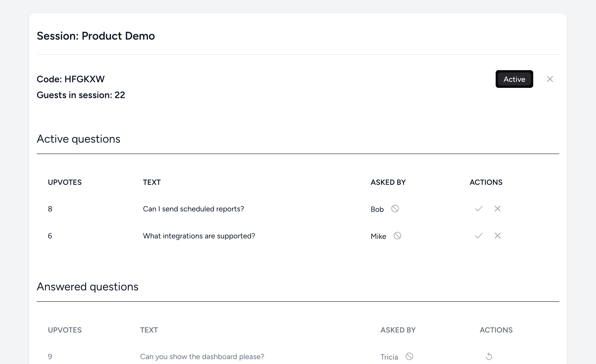
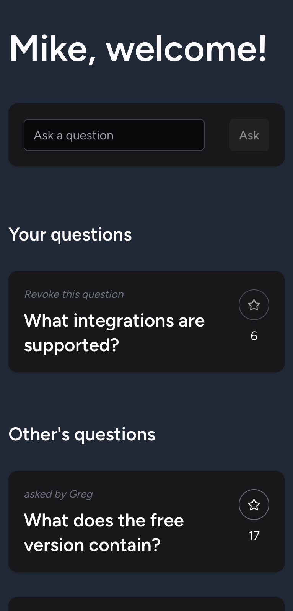

# AskNVote

Welcome to AskNVote, a dynamic web application designed for users to ask questions and upvote the most relevant queries. Developed as a portfolio project, but deployable to production, AskNVote showcases modern web technologies and real-time interaction capabilities.

## Project Goals

AskNVote aims to:
- Provide a platform where users can interact by asking and voting on questions, for example in a webinar scenario
- Implement session-based authentication for secure, temporary access for attendees
- Use Laravel's strong authentication features with profile management and 2FA for admin users
- Offer real-time updates to ensure users and admins see live, fresh data.
- Include an admin dashboard for moderation and content management.

## Features
- **Crowdsourcing Information:** By allowing questions to rise by vote count, attendees can easily attach to important queries, while admins can prioritize their answers.
- **User Authentication:** Secure attendee access via session codes. Attendees are remembered, no need to re-join session after closing the page.
- **Question Management:** Ask new questions, vote on existing ones. Admins can see questions ordered by votes.
- **Real-Time Updates:** Ensures that attendees as well as admins always seeing the latest data without manual page refreshes.
- **Admin Dashboard:** Delete or mark questions as answered.
- **Moderation Capabilities:** Admins can manage the content, ban malicious users, ensuring the quality and relevance of questions.
- **Security:** Building on Laravel's world-class authentication and authorization features, the platform provides safe access, profile management, email confirmation, 2FA and more.

## Technologies Used

- **Laravel 11:** Backend framework for CRUD operations and authentication.
- **Inertia.js:** Integrates Laravel and Vue.js for a smooth SPA experience, without the need of a frontend router.
- **Vue.js with PrimeVue:** Frontend UI with dynamic components for a cohesive, consistent look. Dark and light modes are supported, fully responsive UI.
- **Docker Compose with Sail:** Development environment, with local MariaDB instance, PhpMyAdmin and Mailpit services.

## Getting Started

### Prerequisites

- Ensure Docker is installed on your machine.

### Installation

To run the development environment, use the following script:
```bash
git clone https://github.com/bcsabae/ask-n-vote.git
cd ask-n-vote
./vendor/bin/sail up -d
./vendor/bin/sail composer install
./vendor/bin/sail artisan migrate
./vendor/bin/sail artisan db:seed
./vendor/bin/sail npm install && ./vendor/bin/sail npm run dev
```

To build assets, simply run 
```bash
./vendor/bin/sail npm run build
```

## Screenshots

Here are some screenshots to give you an idea of the application:

### Admin main dashboard.
  
*Dashboard where admins can see, edit and actiate/inactivate sessions. Light mode, desktop.*

### Admin session dashboard.
  
*Dashboard where admins can manage their ongoing sessions. Light mode, desktop.*

### User Dashboard
  
*Q&A attendee's view. Mobile screen.*

## License

This is a reference project. Please don't use it yourself. Ideas are welcome.
